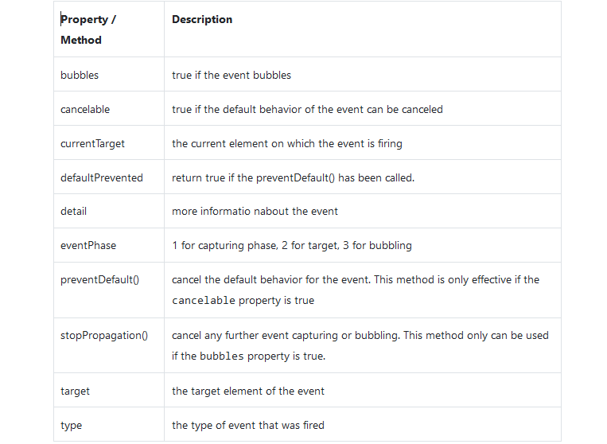
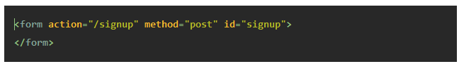
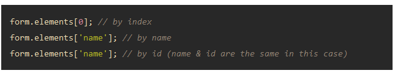
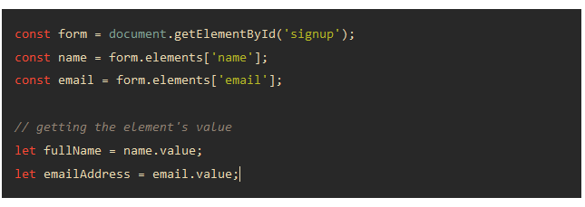

# DOM-JavaScript

   

     The Document Object Model (DOM) is an application programming interface (API) for 
     
     manipulating HTML documents.The DOM represents an HTML document as a tree of nodes. The 
     
     DOM provides functions that allow you to add, remove, and modify parts of the document 
     
     effectively.In the DOM, all HTML elements are defined as objects.The programming interface 
     
     is the properties and methods of each object.
     
     A property is a value that you can get or set (like changing the content of an HTML element).
     
     A method is an action you can do (like add or deleting an HTML element).
     
   

 #### DOM Searching

     If you want to access any element in an HTML page, you always start with accessing the 
     
     document object Below are some examples of how you can use the document object to access 
     
     and manipulate HTML.
  ;

  ;

  ;

 #### Manipulating Element’s Styles

     Setting inline styles

     To set the inline style of an element, you use the style property of that element:
     
     The style property returns the read-only CSSStyleDeclaration object that contains a list 
     
     of CSS properties. For example, to set the color of an element to red, you use the 
     
     following code:

  

     If the CSS property contains hyphens (-) for example -webkit-text-stroke you can use the 
     
     array-like notation ([]) to access the property:

   

     The classList is a read-only property of an element that returns a live collection of CSS 
     
     classes:Even though the classList is read-only, but you can manipulate the classes it 
     
     contains using various methods.

         1) Get the CSS classes of an element
         
         in HTML we have div:
   

         in Script we called it:

   

         output is:

   

     2) Add one or more classes to the class list of an element

     To add one or more CSS classes to the class list of an element, you use the add() method 
     
     of the classList. For example, the following code adds the info class to the class list of 
     
     the div element with the id content:

   

     3) Remove element’s classes

     To remove a CSS class from the class list of an element, you use the remove() method:

   

     4) Toggle a class

     If the class list of an element contains a specified class name, the toggle() method 
     
     removes it. If the class list doesn’t contain the class name, the toggle() method adds it 
     
     to the class list.

   
 #### JavaScript events

     An event is an action that occurs in the web browser, which the web browser feedbacks to 
     
     you so that you can respond to it.Each event may have an event handler which is a block of 
     
     code that will execute when the event occurs.
         
         Example: HTML
         
         <button id="btn">Click Me!</button>
         
         Script: let btn = document.querySelector('#btn');

             function display() {
                 alert('It was clicked!');
             }
             
             btn.addEventListener('click',display);

   
    
     The following table shows the most commonly-used properties and methods of the event object:
 
    

 #### JavaScript Forms

     To create a form in HTML, you use the <form> element:

     The <form> element has two important attributes: action and method.
     
         1) The action attribute specifies a URL that will process the form submission. In this 
         
            example, the action is the /signup URL.

          2) The method attribute specifies the HTTP method to submit the form with. Usually, 
         
            the method is either post or get.
     
     Generally, you use the get method when you want to retrieve data from the server and the 
     
     post method when you want to change data on the server.
     
     The HTMLFormElement element also provides the following useful methods:

         -- submit() – submit the form.
         
         -- reset() – reset the form.
 
     Accessing form fields

     To access form fields, you can use DOM methods like getElementsByName(), getElementById(), 
     
     querySelector(), etc.

   

     And use index, id, or name to access the element. The following accesses the first form element:

   

     After accessing a form field, you can use the value property to access its value, for example:

   
